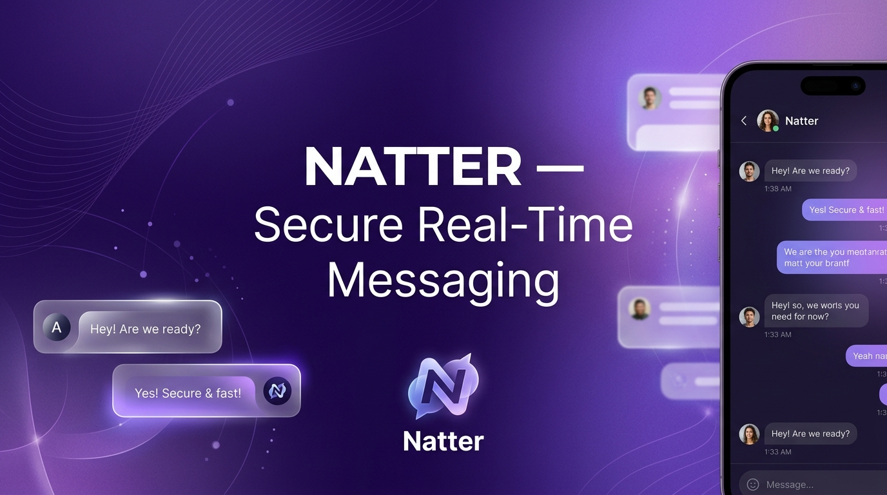
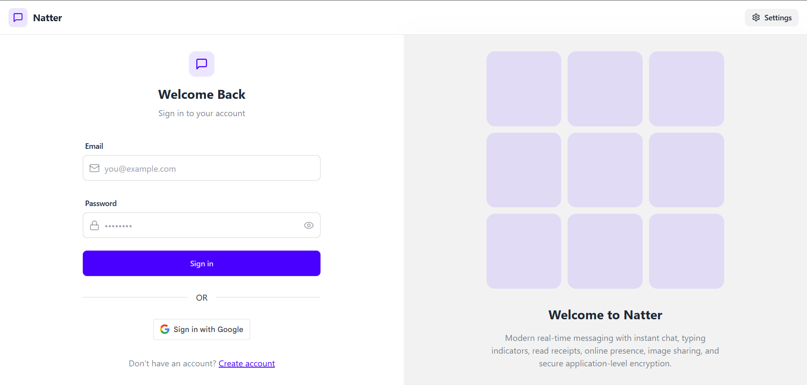
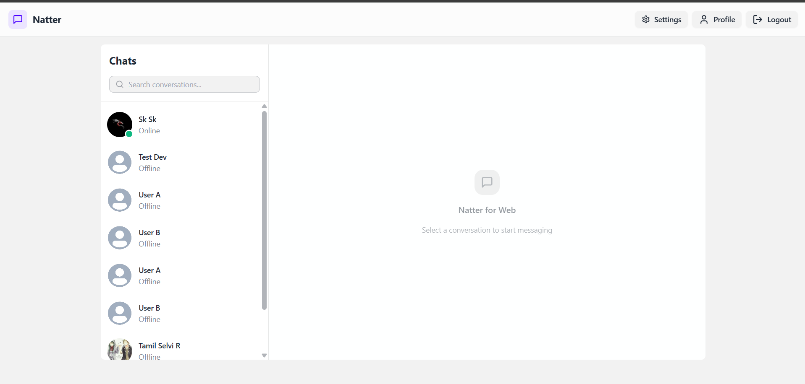
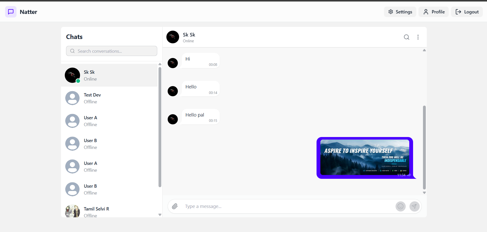
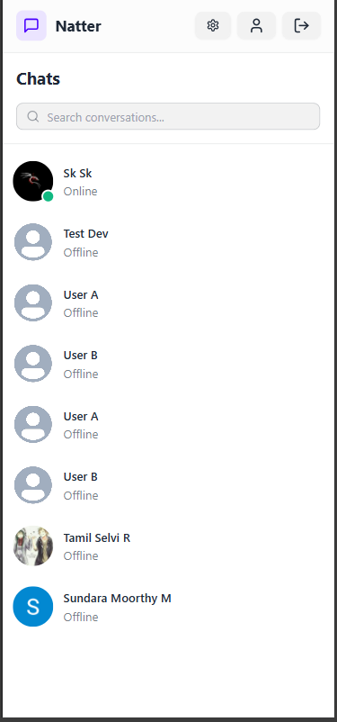
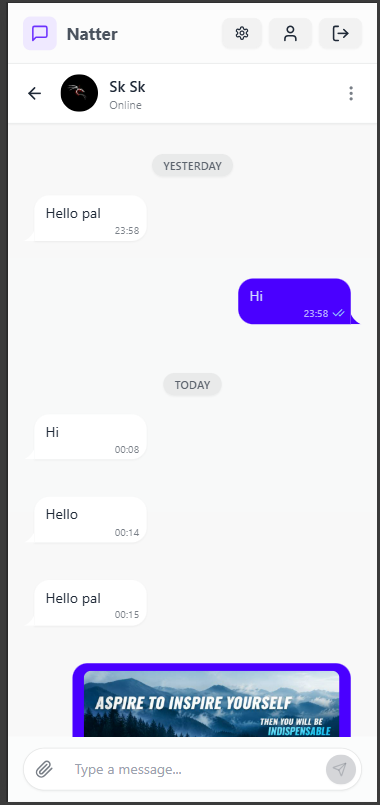
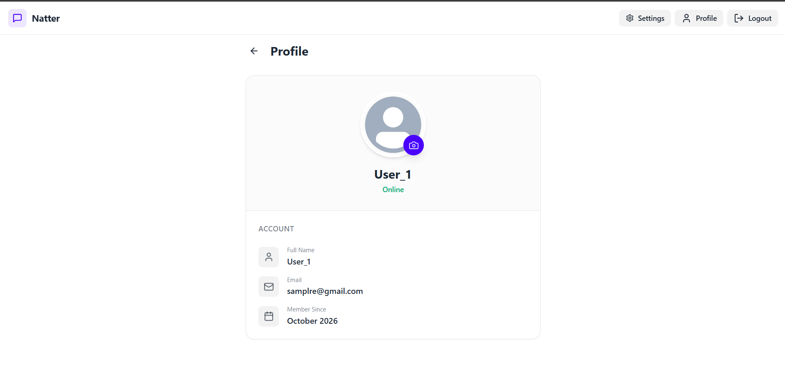
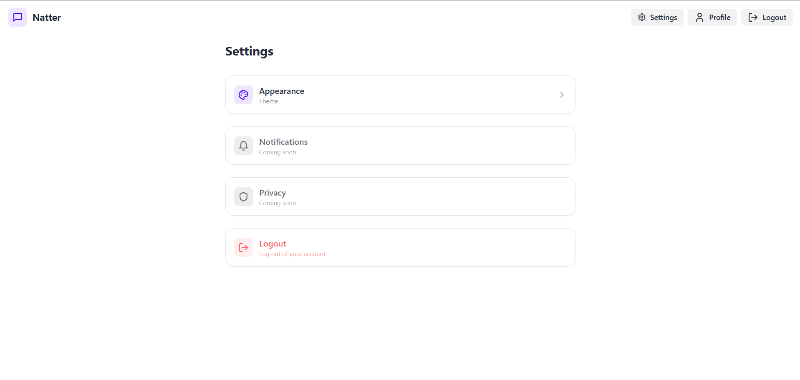
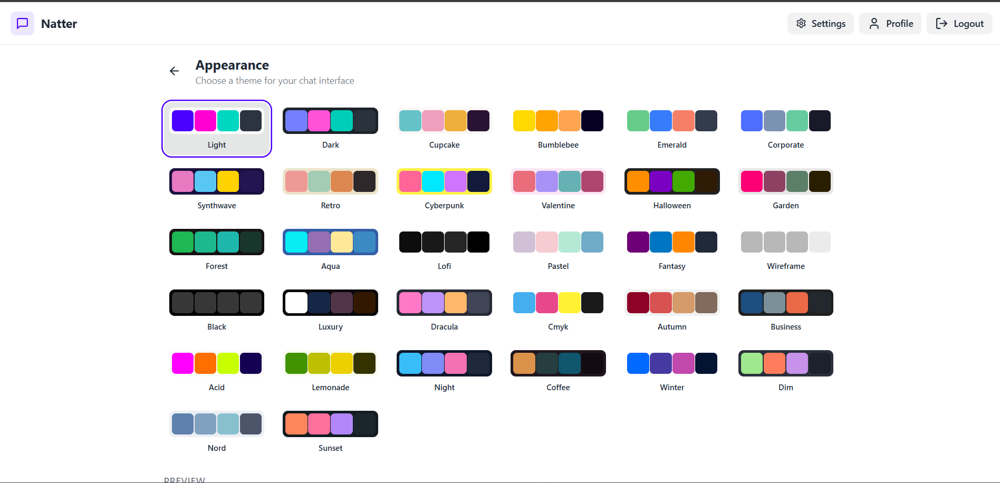
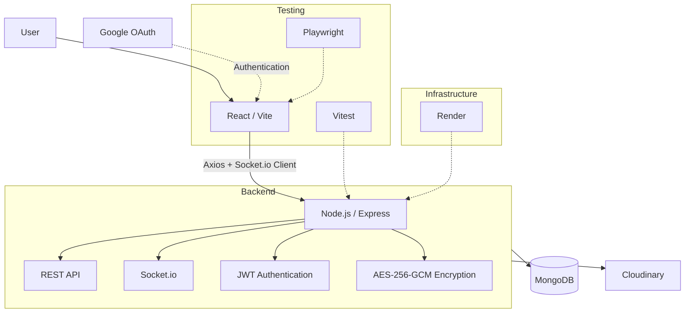

<div align="center">
  

  # Natter
  **Real-Time Messaging Platform**

  <p>
    Natter is a modern, full-stack real-time messaging application built with React, Node.js, MongoDB, and Socket.io. Designed for speed and security, it features instant bi-directional communication, presence tracking, and application-level message encryption.
  </p>

  <div>
    
    
    
    
    
    
    
  </div>
  
  <br />
  
  [**Live Demo**](https://natter-u4on.onrender.com) | [**GitHub Repository**](https://github.com/Surendra-Kumar-M/Natter)
</div>

<hr />

## Screenshots

- **Login**  
  
- **Chats desktop**  
  
- **Active chat desktop**  
  
- **Mobile chats**  
  
- **Mobile active chat**  
  
- **Profile**  
  
- **Settings**  
  
- **Appearance/theme**  
  

---

## Features

### Messaging
- Real-time one-to-one messaging
- Typing indicators
- Sent/delivered/read states
- Unread message badges
- Message persistence
- Date separators

### Presence
- Online/offline status
- Last seen
- Multi-tab/multi-device socket presence

### Media
- Image messages
- Cloudinary integration
- Client-side image compression
- Image preview

### Authentication
- Email/password
- JWT authentication
- HTTP-only cookie/session handling
- Google Sign-In

### Security
- Authenticated Socket.io connections
- Rate limiting
- Input validation
- AES-256-GCM application-level message encryption
- No plaintext persistence for newly encrypted messages

*(Note: Natter provides application-level encryption at rest, not end-to-end encryption).*

### UX
- Responsive mobile-first chat
- Desktop two-pane messaging interface
- Tablet support
- Themes
- Profile/settings

---

## Architecture



---

## Security Architecture

Natter implements **application-level encryption at rest**. It does not provide end-to-end encryption (E2EE), meaning the server processes messages in plaintext in memory before encrypting them for database storage.

**Message Sending Lifecycle:**
`Client → HTTPS → Express → AES-256-GCM → MongoDB`

**Message Retrieval Lifecycle:**
`MongoDB → Express → decrypt in memory → HTTPS → Client`

**Cryptographic Details:**
- **Algorithm**: `AES-256-GCM` (Galois/Counter Mode).
- **Storage Profile**: Encrypted payloads are stored with four distinct fields:
  - `ciphertext`: The Base64 encrypted message content.
  - `iv`: The highly unique 12-byte Initialization Vector.
  - `authTag`: The GCM authentication tag for tamper detection.
  - `keyVersion`: Explicit key versioning to allow for seamless future key rotation (`v1`).

---

## Testing

Natter maintains a rigorous automated testing pipeline.

**Unit Tests (Backend):**
Powered by Vitest, focusing on core cryptographic and authentication logic:
- `encryption/decryption`: Validation of symmetric key behavior.
- `tamper detection`: Ensuring malformed or altered `authTag`/`IV` strings throw rejection errors.
- `authentication middleware`: Verification of JWT lifecycle.
- `malformed payloads`: Stress-testing validation handlers.

**End-to-End Tests (Frontend):**
Powered by Playwright, isolating workflows across two independent browser contexts (`User A` ↔ `User B`). 
- **Tests Include**: Login, messaging workflows, duplicate-message regression, typing indicators, read receipts, unread badges, image uploads, and multi-tab session persistence.
- **Validation**: The automated suite has been validated locally and against the deployed Render application. *(Note: Occasional timeouts on the Render free-tier may occur during multi-socket E2E tests due to cold-starts and connection throttling).*

---

## Tech Stack

| Domain | Technologies |
|---|---|
| **Frontend** | React, Vite, Zustand, Tailwind, DaisyUI, Socket.io-client |
| **Backend** | Node.js, Express, Mongoose, Socket.io |
| **Security** | JWT, Google OAuth, AES-256-GCM, Express Rate Limiting |
| **Storage** | MongoDB, Cloudinary |
| **Testing** | Vitest, Playwright |
| **Deployment** | Render |

---

## Environment Setup

Natter requires explicit environment variables to run. **Never commit actual secret values.** 

Copy the provided `.env.example` files to `.env` (backend) and `.env.local` (frontend) respectively, and populate them using the structures below as a template.

**Backend (`backend/.env`)**
```env
# Application server configuration
PORT=5001
NODE_ENV=development

# Database
MONGODB_URI=mongodb+srv://<user>:<password>@<cluster>.mongodb.net/<db>

# Authentication & Crypto (Must be strong, secure values)
JWT_SECRET=your_super_secret_jwt_key
MESSAGE_ENCRYPTION_KEY=32_byte_base64_encoded_key_string

# Cloudinary Integration
CLOUDINARY_CLOUD_NAME=your_cloud_name
CLOUDINARY_API_KEY=your_api_key
CLOUDINARY_API_SECRET=your_api_secret

# Google OAuth
GOOGLE_CLIENT_ID=your_google_client_id.apps.googleusercontent.com
```

**Frontend (`frontend/.env.local`)**
```env
# Public Configuration
VITE_API_URL=http://localhost:5001/api
VITE_SOCKET_URL=http://localhost:5001
VITE_GOOGLE_CLIENT_ID=your_google_client_id.apps.googleusercontent.com
```

---

## Local Development

From the root of the repository, follow these steps to spin up the local development environment:

1. **Install dependencies:**
   ```bash
   cd backend
   npm install
   cd ../frontend
   npm install
   ```

2. **Start the backend server:**
   ```bash
   cd backend
   npm run dev
   ```

3. **Start the frontend development server:**
   ```bash
   cd frontend
   npm run dev
   ```

---

## Testing Commands

Ensure your servers are running locally before executing end-to-end tests.

**Run Backend Unit Tests:**
```bash
cd backend
npm run test
```

**Run Frontend E2E Tests:**
```bash
# Set dedicated E2E credentials before execution
# E2E_USER_A_EMAIL, E2E_USER_A_PASSWORD
# E2E_USER_B_EMAIL, E2E_USER_B_PASSWORD

cd frontend
npm run test:e2e
```

---

## Deployment

Natter is configured for deployment on Render.

1. **Build Configuration**: Connect your GitHub repository to a Render Web Service.
2. **Build Command**: `npm run build`
3. **Start Command**: `npm start`
4. **Environment Variables**: Add all production keys required in your backend `.env` directly into the Render dashboard. Ensure `NODE_ENV` is set to `production`.
5. **Socket.io Configuration**: No special Render proxy configuration is required; Render handles WebSockets seamlessly over standard HTTPS ports. 
6. **Production URLs**: Update your frontend to hit your generated `https://your-service.onrender.com` URL.

---

## Known Limitations

- **Encryption Model**: Messages utilize robust application-level encryption at rest. This is *not* end-to-end encryption (E2EE), meaning the server possesses the capability to decrypt payloads in memory.
- **Media Encryption**: Images uploaded via Cloudinary are stored securely but are not natively encrypted by the Natter application lifecycle.
- **Infrastructure Reliability**: Deployments on the Render free-tier may occasionally experience cold-start latency or dropped Socket.io connections under heavy parallel loads.
- **PWA Capabilities**: Progressive Web App background push notifications are limited due to current service worker architecture.
- **OAuth Flexibility**: Users authenticated solely via Google Sign-In currently bypass explicit password creation, which may require a future password-setup flow for hybrid logins.

---

## Future Improvements

- Implementation of true End-to-End Encryption (E2EE) utilizing Web Crypto API.
- Native mobile push notifications.
- Richer notification granularity and do-not-disturb controls.
- Improved media lifecycle management (automated purging of orphaned Cloudinary assets).
- Migration to stronger, dedicated production infrastructure to eliminate WebSocket throttling.

---

## License

This project is licensed under the ISC License.
